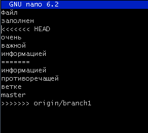

# Отчет по выполнению лабораторной работы №6

## Шаги выполнения

### 1. Создание аккаунта на GitHub
Создан аккаунт на сайте [GitHub](https://github.com).


### 2. Форк репозитория
Сделан форк репозитория [Kurtyanik/LR6](https://github.com/Kurtyanik/LR6) в личное хранилище.


### 3. Установка Git
Git уже установлен с официального сайта [git-scm.com](https://git-scm.com).


### 4. Настройка Git
Настроен клиент git:
```bash
git config --global user.name "В3441 Кулаков Р.С."
git config --global user.email "roman.qwonix@gmail.com"
```


### 5. Клонирование репозитория
Личный удалённый репозиторий клонирован на локальный компьютер:
```bash
git clone https://github.com/qwonix/LR6.git
```


### 6. Добавление файла через интерфейс GitHub
Файл добавлен через интерфейс GitHub. Изменения подтянуты в локальный репозиторий:
```bash
git pull
```


### 7. Получение истории операций
История операций для каждой ветки получена:
```bash
git log
```


### 8. Просмотр последних изменений
Просмотр последних изменений:
```bash
git diff
```


### 9. Слияние в ветку master
Слияние выполнено, конфликт разрешён:
```bash
git merge branch1
```




Конфликт разрешён с использованием редактора **nano**.

### 10. Удаление побочной ветки
Побочная ветка удалена:
```bash
git branch -d branch1
```


### 11. Фиксация изменений
Сделаны несколько изменений и зафиксированы с комментариями:
```bash
git add .
git commit -m "comment"
```


### 12. Откат коммита
Откат коммита выполнен:
```bash
git reset --hard HEAD~1
```


### 13. Создание ветки для отчёта
Создана новая ветка:
```bash
git checkout -b report
```

### 14. Оформление отчёта
Отчёт оформлен в файле `README.md` с использованием Markdown. 
Скриншоты помещены в папку `screenshots`.

---

## Лог команд

```bash
git clone https://github.com/qwonix/LR6.git
git pull
git log
git diff
git merge branch1
git branch -d branch1
git add .
git commit -m "comment"
git reset --hard HEAD~1
git checkout -b report
```